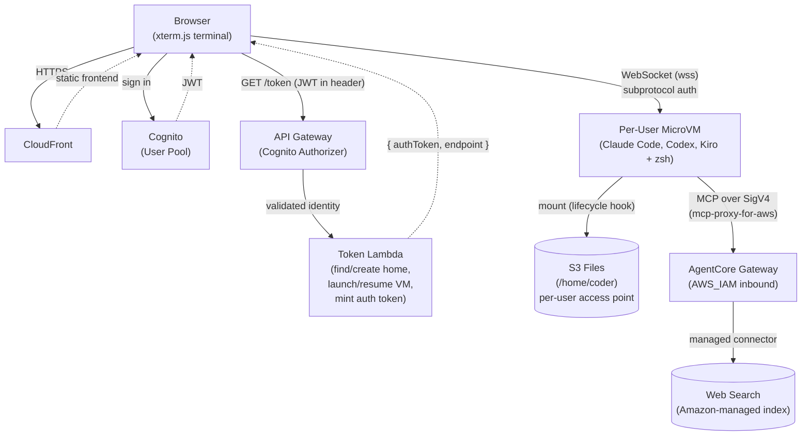

# Remote Developer (rDev)

A browser-based terminal — built for the iPad, works anywhere — that runs
[Claude Code](https://www.anthropic.com/claude-code),
[Codex CLI](https://developers.openai.com/codex/cli/), and
[Kiro CLI](https://kiro.dev/docs/cli/setup.md) inside an **AWS Lambda
MicroVM**, with a persistent home directory backed by **Amazon S3**. Open a URL,
log in, and work with any of the three CLIs in a real shell. Claude Code and
Codex run against Amazon Bedrock (no API keys); Kiro CLI is a separate hosted
service each user signs into with their own account. Close the tab and come
back later — your files, history, and each CLI's login state are still there.

> ⚠️ **This is a demo / small-team project, not a hardened product.** Auth is
> Cognito (admin-created users, per-user MicroVMs), but the sandbox runs with a
> broadly-privileged AWS role. Read the [Security](#security) section before
> deploying anywhere sensitive.

---

## How it works



- **Frontend** — a single `index.html` (xterm.js) on S3, served via CloudFront.
  The user signs in against Cognito (via `amazon-cognito-identity-js`), gets a
  JWT, then opens a WebSocket straight to their MicroVM's service-managed
  endpoint, authenticating via the `lambda-microvms.*` subprotocols. On the wire
  it speaks the ttyd binary protocol.
- **Auth — Cognito + API Gateway.** A Cognito User Pool holds admin-created
  users (no self-signup). **API Gateway's Cognito authorizer validates the JWT
  before the token Lambda ever runs** — the Lambda never sees a password, only
  the already-verified identity.
- **Token Lambda** — reads the verified Cognito `sub` from the request context,
  finds-or-creates that user's S3 Files access point (scoped to `/users/<sub>`),
  launches or resumes **that user's own MicroVM**, and mints a short-lived auth
  token. Hand-rolled SigV4, so it's immune to AWS CLI command-name churn.
- **MicroVM image** — Amazon Linux 2023 + Node, Python 3.13, the AWS CLI, `uv`,
  Claude Code, Codex CLI, and Kiro CLI. `terminal.js` is a WebSocket PTY server.
  `claude` defaults to Opus 5, `claude-model` selects any current Claude family
  model, and Codex uses Amazon Bedrock's current supported OpenAI catalog. The
  image refreshes a managed MicroVM briefing for each CLI after the user's home
  mount, without replacing CLI history, preferences, or Kiro login state.
  The per-user home is mounted at run time by the `/run` lifecycle hook (which
  receives the access-point id in its payload) — `mount -o accesspoint=<id>` —
  so each user gets an isolated `/home/coder` that persists across restarts.
- **Web search** — native WebSearch/WebFetch aren't available on Bedrock, so
  each in-VM CLI gets managed web search through **Amazon Bedrock AgentCore**:
  the `workspace-web-search` MCP server uses the managed `web-search` connector
  behind an AgentCore Gateway (`AWS_IAM` inbound auth). The VM reaches it via
  the already-baked `mcp-proxy-for-aws`, SigV4-signed with the execution role
  from IMDS — no API keys, and queries stay inside AWS. `mount-home.sh` refreshes
  only this image-owned MCP entry for Claude, Codex, and Kiro while preserving
  their unrelated user configuration.
- **SAM template** (`template.yaml`) — VPC + security group, the S3 buckets
  (frontend / artifacts / workspace), the S3 Files filesystem + mount targets,
  the Cognito pool + authorizer, IAM roles, the token Lambda + API Gateway,
  CloudFront, a Lambda Network Connector for VPC egress to the S3 Files
  mount targets, and the MicroVM image itself as a first-class
  `AWS::Serverless::MicrovmImage` resource (name, memory tier, OS
  capabilities, and lifecycle hooks are all literals on that one resource —
  see its comment in `template.yaml`). One `sam deploy` provisions all of it,
  including building/updating the MicroVM image; only the AgentCore
  web-search gateway is created out-of-band by `deploy.sh` (a CFN resource
  handler bug with the connector's target config — see that resource's
  comment).

**Per-user isolation:** each Cognito user gets their own MicroVM and their own
home directory (an S3 Files access point scoped to their `sub`). Adding a user
in the pool is all it takes — their first login provisions their VM and home on
demand.

Claude Code defaults to **Claude Opus 5**. Use `claude-model opus`,
`claude-model sonnet`, `claude-model haiku`, or `claude-model fable` for the
latest available model in each Claude family. Codex `0.154.0` uses Amazon
Bedrock's current OpenAI catalog: GPT-6 Astra plus GPT-5.6 Sol, Terra, and
Luna. Use `/model` in Codex to switch, or start `codex-astra` for a new
Astra session or `codex-grok` for Grok 4.6 through Bedrock. The workspace
control plane stays in `us-east-1`, while Codex routes its Mantle requests to
`us-west-2`, where Astra and Grok are available. Kiro CLI needs a one-time
device-flow login (`kiro-cli login` — see below) before use; once signed in,
start it with `kiro-cli`. All three tools share workspace files while
retaining their own configuration, history, and login state under
`/home/coder`.

### Signing in to Kiro CLI

Kiro CLI isn't part of this app's AWS account or Bedrock — it's a separate
hosted service, so each user authenticates with their own Kiro account. The
browser terminal has no local browser for Kiro to launch, so it falls back to
its **device-flow** login automatically:

```
kiro-cli login
```

This prints a URL and a one-time code — no port-forwarding or local browser
needed. Open that URL in **any** browser (your phone, another tab, whatever's
on hand), sign in (GitHub, Google, AWS Builder ID, IAM Identity Center, or an
external IdP), and enter the code. Once approved, the session is stored under
`~/.kiro` in that user's S3 Files-backed home, so it's a **one-time step per
user** — it survives VM restarts and recycles, not just the current session.
Check status any time with `kiro-cli whoami`; re-run `kiro-cli login` if a
session expires.

Kiro's own web-search MCP wiring, steering file, and permissions are
image-managed the same way as Claude's and Codex's (see "Web search" above) —
login is the only thing a user has to do by hand.

On each newly mounted workspace, a background refresh runs the official `aws
configure agent-toolkit --yes` workflow under the workspace user. It installs
the latest default AWS skills and configures the AWS MCP server for Claude,
Codex, and Kiro. The image then refreshes the official `aws-core` plugin for
Claude and Codex. The refresh records progress in
`~/.agent-toolkit-status`; it does not touch user projects, API keys, or Kiro
login state.

All three CLIs are configured for unattended work inside this dedicated
MicroVM. Claude Code uses `bypassPermissions`; Codex bypasses approvals and its
local sandbox; Kiro has a persistent allow-all policy. The MicroVM remains the
isolation boundary, and Agent Toolkit safety hooks can still block protected
operations.

---

## Prerequisites

- An AWS account with **Bedrock model access enabled** in **`us-east-1`** for
  the current Claude family, and in **`us-west-2`** (Bedrock Mantle — where the
  `codex` wrapper points model calls) for the OpenAI models Codex uses (GPT-6
  Astra, GPT-5.6 Sol/Terra/Luna) and for xAI's Grok 4.6 (`codex-grok`). The
  deployed image pins Codex `0.154.0`, which includes Astra in the Amazon
  Bedrock model picker.
- **Kiro CLI needs its own account**, unrelated to this AWS account or
  Bedrock — it's a hosted service. Each user signs in themselves on first use;
  see [Signing in to Kiro CLI](#signing-in-to-kiro-cli) below.
- **AWS Lambda MicroVMs** available in your region (this project uses
  `us-east-1`). MicroVMs are a newer capability — make sure your account/region
  has access.
- Local tooling: **AWS CLI v2**, the **AWS SAM CLI**, and **Node.js 20+**. Docker
  is *not* required — the MicroVM image is built server-side by the build service.
  Inside the workspace, `kiro-cli login` performs its one-time device-flow login;
  its persisted session remains in the user's S3 Files-backed home.

The SAM stack provisions everything, including the **S3 Files filesystem** and
its VPC mount targets (the persistent per-user `/home/coder`). You don't create
anything by hand — `sam deploy` makes it all.

---

## Deploying

### First install and recovery

`scripts/deploy.sh` fails closed unless the caller is account `112280397275` in
`us-east-1`. It deploys the independent `rdev-governance` stack first, then
uses the same `ipad-claude` stack for both phases:

1. Bootstrap: `sam build && sam deploy` creates the artifact bucket, IAM
   boundary, and AgentCore gateway role with `MicrovmCodeUri` empty.
2. Full install: `./scripts/deploy.sh` uploads the content-hashed image,
   reconciles the named gateway/target, and updates that same stack.

Rollback is disabled so an interrupted install can be diagnosed and retried;
never delete the stack, retained workspace bucket, or Cognito pool as recovery.
The immutable `CreatedDate` parameter is used for governance tags. The budget
alerts at 50%, 80%, and 100% for both actual and forecast monthly spend, but
does not cap AWS charges.

Resources that AWS does not expose tag properties for are explicitly treated as
untaggable: route-table associations, S3 Files mount targets, Cognito clients,
bucket policies, CloudFront OAC, generated SAM resources, AgentCore targets,
and runtime MicroVM instances. Their owning stack/resource identifiers remain
in CloudFormation or deployment evidence.

Local `sam validate --lint` may report E3006 for the emerging S3 Files,
MicroVM Image, and Network Connector resource types (and a generated SAM
condition reachability warning); deployed CloudFormation states are authoritative.

**The one command that does everything is `./scripts/deploy.sh`** (see
[Just run the script](#just-run-the-script) below). If you only want a working
deployment, skip there.

The rest of this section walks the four layers by hand — infra, frontend, image,
user — so you can see what the script automates. The snippets build on each
other: run them in **one shell session**, top to bottom, after the Configure
step. They're a teaching aid, not a substitute for the script.

### Configure

```bash
cp samconfig.toml.example samconfig.toml
$EDITOR samconfig.toml    # set region, and profile if you don't use your default
```

`samconfig.toml` is how `sam build`/`sam deploy` know the stack name, region,
profile, and capabilities — nothing in this repo reads it except `sam` itself.
It's git-ignored (see `samconfig.toml.example` for the committed template), so
your profile name never gets committed.

Optionally personalize the `admin-create-user` email that shows up in the
stack's Outputs (cosmetic only — it's not a credential) by uncommenting
`parameter_overrides` in `samconfig.toml`, e.g.:

```toml
parameter_overrides = "LoginEmail=\"you@example.com\""
```

Skip this and it defaults to `you@example.com` — you can always override it
per-command with `sam deploy --parameter-overrides LoginEmail=...`, or just
edit the created user's email later. Whatever value CloudFormation last saw
for `LoginEmail` is retained on every future deploy, since `deploy.sh` never
passes it itself.

Helper used by every stage below — pulls one stack output by key (relies on
`sam`'s AWS CLI env resolution, same as everything else here):

```bash
out() { aws cloudformation describe-stacks --stack-name ipad-claude \
  --query "Stacks[0].Outputs[?OutputKey=='$1'].OutputValue" --output text; }
```

### Stage 1 — Infrastructure (SAM)

The whole stack is one AWS SAM template (`template.yaml`): the VPC + NAT +
subnets + NFS security group, the three S3 buckets, the **S3 Files filesystem +
mount targets**, the Cognito user pool + client, the token-vending Lambda +
API Gateway (with the Cognito authorizer), CloudFront, the VPC-egress network
connector, and the MicroVM image itself.

```bash
sam build
sam deploy
```

No flags needed — `samconfig.toml` supplies the stack name, region, profile,
and capabilities. The very first deploy won't yet have a real
`MicrovmCodeUri` to pass, so it fails fast on that required parameter; that's
expected — see [Just run the script](#just-run-the-script) below for the
one-time bootstrap order. Inspect all outputs any time with:

```bash
aws cloudformation describe-stacks --stack-name ipad-claude \
  --query "Stacks[0].Outputs" --output table
```

### Stage 2 — Frontend (S3 + CloudFront)

The frontend is one static `index.html` with a placeholder line
`window.APP_CONFIG = {}; /* APP_CONFIG_PLACEHOLDER */`. Replace it with the real
config — token API URL, region, and Cognito pool/client ids from Stage 1's
outputs — then upload and invalidate the CDN.

```bash
REGION="${AWS_REGION:-$(aws configure get region 2>/dev/null || echo us-east-1)}"
CONFIG=$(cat <<JSON
{"tokenApiUrl":"$(out TokenApiUrl)","region":"$REGION","userPoolId":"$(out UserPoolId)","userPoolClientId":"$(out UserPoolClientId)"}
JSON
)

# Replace the whole placeholder line with the injected config.
sed "s|<script>window.APP_CONFIG = {}; /\* APP_CONFIG_PLACEHOLDER \*/</script>|<script>window.APP_CONFIG = $CONFIG;</script>|" \
  frontend/index.html > /tmp/index.html

aws s3 cp /tmp/index.html "s3://$(out FrontendBucketName)/index.html"
aws cloudfront create-invalidation --distribution-id "$(out CloudFrontDistributionId)" --paths "/*"
```

### Stage 3 — MicroVM image

The image is a real CFN resource (`AWS::Serverless::MicrovmImage` — see
`MicrovmImage` in `template.yaml`), not a hand-rolled CLI dance. Its
configuration — name (`remote-dev`), memory tier (4096 MiB baseline), OS
capabilities, base image, and lifecycle hooks — are all literals on that one
resource. All you provide from outside is `CodeUri`: an S3 URI to the zipped
`microvm/` source, passed as the `MicrovmCodeUri` parameter.

```bash
ARTIFACT_BUCKET=$(out ArtifactBucketName)
S3_FILES_FS_ID=$(out S3FilesFileSystemId)   # the stack created this in Stage 1

# Render the FS id into a build copy (never commit an account-specific value).
BUILD_DIR=/tmp/rdev-microvm-build
rm -rf "$BUILD_DIR"; cp -R microvm "$BUILD_DIR"
sed -i.bak "s|^ENV S3_FILES_FS_ID=.*|ENV S3_FILES_FS_ID=${S3_FILES_FS_ID}|" "$BUILD_DIR/Dockerfile"
rm -f "$BUILD_DIR/Dockerfile.bak"

# Content-hash the zip into its S3 key: CloudFormation only diffs property
# VALUES, and MicrovmImage's CodeUri isn't in SAM's auto-upload list (unlike
# a Function's CodeUri), so a fixed key would silently never trigger a
# rebuild on a real change.
ZIP_PATH=/tmp/rdev-microvm.zip
rm -f "$ZIP_PATH"; (cd "$BUILD_DIR" && zip -r "$ZIP_PATH" . -x "*.DS_Store")
ZIP_HASH=$(shasum -a 256 "$ZIP_PATH" | cut -c1-16)
ZIP_KEY="microvm/remote-dev-microvm-${ZIP_HASH}.zip"
aws s3 cp "$ZIP_PATH" "s3://$ARTIFACT_BUCKET/$ZIP_KEY"

sam deploy --parameter-overrides "MicrovmCodeUri=s3://$ARTIFACT_BUCKET/$ZIP_KEY"
```

`sam deploy` waits on CloudFormation's own stabilization for the image build
(~5-10 min on a real change to `microvm/`) — no manual polling needed. If
`microvm/` hasn't changed, the hash produces the same key and CodeUri comes
out identical, so CloudFormation no-ops the resource. Changing
`AdditionalOsCapabilities` is now an ordinary in-place update too (the old
CLI-based flow required deleting and recreating the image for that).

**You don't launch a persistent MicroVM here** — the token Lambda does that
per user, on demand: when a user logs in, it reads their verified Cognito
`sub`, creates their S3 Files access point, and calls `run-microvm` with the
access-point id in `--run-hook-payload` (the `/run` hook mounts it). The
ingress connectors expose HTTP (the terminal) and SHELL (the `tools/` helpers);
the egress connector reaches the S3 Files mount targets.

### Stage 4 — Create a user

Auth is Cognito with no self-signup, so you create users yourself. `sam
deploy` already printed a ready-to-run command for this as the
`CreateUserCommand` output (built from the `LoginEmail` parameter you set in
Configure) — just copy it from the deploy output, or fetch it again any time:

```bash
out CreateUserCommand
```

It looks like:

```bash
aws cognito-idp admin-create-user \
  --user-pool-id <pool-id> --username you@example.com \
  --user-attributes Name=email,Value=you@example.com Name=email_verified,Value=true \
  --temporary-password 'ChangeMe-123!'
```

This creates the user with a **temporary password**. On first sign-in the app
prompts them to choose a new permanent one (Cognito's standard
`NEW_PASSWORD_REQUIRED` flow, which the login screen handles).

- Run it as printed to set that temp password yourself.
- To skip the first-login prompt entirely and set a ready-to-use password:
  ```bash
  aws cognito-idp admin-set-user-password \
    --user-pool-id "$(out UserPoolId)" --username you@example.com \
    --password 'YourReal-Password1!' --permanent
  ```

Now open the CloudFront URL, sign in with that email and password, and you're in
the terminal — with your own MicroVM and persistent home.

### Just run the script

`scripts/deploy.sh` does all of the above end-to-end: ensures the AgentCore
web-search gateway, packages and uploads the MicroVM source, runs
`sam build` + `sam deploy` (which creates/updates the stack **and** the
MicroVM image in one shot), syncs the frontend config, then launches a
throwaway VM to smoke-test the image and tears it down. `sam deploy` itself
prints `TokenApiUrl`, `FrontendUrl`, `UserPoolId`, `LoginEmail`, and
`CreateUserCommand` as part of its own output — deploy.sh doesn't repeat them.
It does **not** launch a persistent VM — that happens per user at login.

```bash
./scripts/deploy.sh
```

| Flag | Effect |
|---|---|
| *(none)* | Full deploy: web-search gateway + SAM stack (incl. image) + frontend + smoke test |
| `--skip-infra` | Reuse the existing stack outputs — frontend sync + smoke test only |
| `--skip-mvm` | Deploy infra/image but skip the throwaway smoke-test VM |

**Bootstrapping a brand-new stack:** `deploy.sh` resolves `ArtifactBucketName`
and `WebSearchGatewayRoleArn` from the stack's *existing* outputs before it
can compute `MicrovmCodeUri`/`WebSearchGatewayUrl` — so the very first-ever
deploy needs one bare `sam build && sam deploy` first (Stage 1 above) to
create the bucket and role, and it's expected to fail on the required
`MicrovmCodeUri` parameter with nothing to pass yet. Once that first partial
deploy has created the bucket + role, run `./scripts/deploy.sh` normally and
it takes over from there. Every deploy after that is just `./scripts/deploy.sh`.

---

## Operations

Deploying is the only script you need for normal use — once `deploy.sh`
finishes, everything runs from the browser. The helpers in `tools/` are
optional break-glass utilities for reaching *into* a running MicroVM (which has
no SSH; access is over the service ingress connectors). They read
`AWS_PROFILE` / `AWS_REGION` from your environment — export them first:

```bash
export AWS_PROFILE=your-profile AWS_REGION=us-east-1
cd tools && npm install && cd ..   # first time only (installs the `ws` client)
```

MicroVMs are per-user, so both tools need to know **which** user's VM to reach —
pass `--user <email>` (or set `IPAD_CLAUDE_USER`). The user must have logged in
at least once so their VM exists.

- **Interactive shell into a user's MicroVM** (SSH-equivalent, over SHELL_INGRESS):

  ```bash
  node tools/exec.js --user you@example.com          # drops to the `coder` user (zsh)
  node tools/exec.js --user you@example.com --root   # stay root (changes don't persist)
  ```

  Double `Ctrl+C` to disconnect.

- **Run a one-off command in a user's MicroVM** (non-interactive — handy for
  scripting or quick inspection):

  ```bash
  node tools/run-remote.js --user you@example.com 'uname -a' 60   # cmd, optional timeout
  ```

- **Logs / debugging:** `cat /tmp/hooks.log` inside the MicroVM shows the S3
  Files mount attempts; app logs are in CloudWatch under
  `/aws/lambda-microvms/<image-name>`.

---

## Security

Auth and isolation are real (Cognito + per-user MicroVMs + per-user homes), but
a few things still warrant care before you point it at anything sensitive:

- **Auth is Cognito, per-user.** Users are admin-created (no self-signup); each
  gets their own MicroVM and a home directory isolated to their `sub`. API
  Gateway validates the JWT before the Lambda runs. Note the `coder` user has
  passwordless `sudo` **inside their own VM** — fine, since the VM and home are
  per-user, but it does mean a user is root within their own sandbox.
- **Broad AWS privileges — the main thing to scope.** The MicroVM runs as
  `MicroVmExecutionRole`: **`PowerUserAccess`** (full access to AWS services)
  **plus boundary-gated IAM writes** so full-stack deploys (`sam deploy`, CDK)
  work from inside the sandbox. The escalation guardrail is a permissions
  boundary (`SandboxPermissionsBoundary`): every role created from the sandbox
  must carry it, it caps those roles at the sandbox's own privilege level, and
  it self-propagates to roles *they* create. IAM users/access keys are never
  grantable, the boundary itself can't be edited or detached, and the
  sandbox's own `ipad-claude-*` roles are off-limits. Anything Claude (or the
  user) runs in the terminal wields these credentials (resolved from the
  instance role via IMDS), **and every user's VM shares this one role**.
  Scope `MicroVmExecutionRole` down in `template.yaml` to only the services
  your sandbox needs before using it anywhere real.
- **Bedrock spend.** VMs can call Bedrock freely; there's no per-user budget cap
  wired in. Add one if runaway usage is a concern.
- **Web search spend.** AgentCore Web Search is billed per query (~$7 per 1,000
  at time of writing) and, like Bedrock, has no per-user cap wired in. The
  gateway is shared across all users' VMs.
- **No network isolation of the workload.** MicroVMs have open outbound internet
  by default.

For a production multi-tenant deployment you'd additionally want a per-user
(or per-tenant) scoped execution role rather than one shared `PowerUserAccess`
role, plus spend controls and egress restrictions.

### Deploying from inside the sandbox

The sandbox can run full-stack deploys (`sam deploy`, CDK, CloudFormation)
including role creation — with one requirement: **every IAM role created from
inside the sandbox must carry the permissions boundary**

```
arn:aws:iam::<account-id>:policy/ipad-claude-sandbox-boundary
```

(get the account id from `aws sts get-caller-identity`). A `CreateRole`
without it is denied — if a deploy fails with `AccessDenied` on
`iam:CreateRole`, a missing boundary is almost always why. How to attach it:

- **SAM** — all function roles at once, in `template.yaml`:

  ```yaml
  Globals:
    Function:
      PermissionsBoundary: arn:aws:iam::<account-id>:policy/ipad-claude-sandbox-boundary
  ```

  or per-role via the `PermissionsBoundary` property on `AWS::IAM::Role`.

- **CDK** — apply it to the whole app so every construct-created role gets it:

  ```json
  // cdk.json
  { "context": { "@aws-cdk/core:permissionsBoundary": {
      "name": "ipad-claude-sandbox-boundary" } } }
  ```

  or per-role: `new iam.Role(..., { permissionsBoundary:
  iam.ManagedPolicy.fromManagedPolicyName(this, 'Pb', 'ipad-claude-sandbox-boundary') })`.

- **CLI** —

  ```bash
  aws iam create-role --role-name my-role \
    --permissions-boundary arn:aws:iam::<account-id>:policy/ipad-claude-sandbox-boundary \
    --assume-role-policy-document file://trust.json
  ```

The boundary caps created roles at the sandbox's own privilege level and
propagates itself: roles created from the sandbox can create further roles,
but only ones carrying the same boundary. The in-VM `CLAUDE.md` briefing
carries these same instructions, so Claude inside the sandbox handles this
automatically.

---

## Repo layout

```
template.yaml         the SAM template — all AWS infrastructure, including
                       the MicrovmImage resource (name/memory/capabilities/
                       hooks all literal on that one resource)
samconfig.toml.example  copy to samconfig.toml and fill in (git-ignored)
functions/
  token-vend/         token-vending Lambda (SigV4, Cognito sub, MicroVM lifecycle)
frontend/index.html   the xterm.js terminal + Cognito login screen
microvm/              MicroVM image
  Dockerfile          AL2023 + Node/Python/uv/AWS CLI + Claude Code, Codex, Kiro CLI
  entrypoint.sh       starts hooks.js + terminal.js
  hooks.js            lifecycle hooks — mounts the per-user home on /run;
                      /validate exercises the cold path for platform prefetch
  mount-home.sh       per-user S3 Files mount (-o accesspoint); refreshes every
                      image-owned CLI config below on every mount
  terminal.js         WebSocket PTY server (ttyd protocol)
  zshrc / bashrc      seeded shell config
  skills/             seeded Claude Code skills

  # Web search (all three CLIs, via the AgentCore gateway)
  mcp-config.js            registers the web-search MCP server into a JSON
                            config — used for ~/.claude.json (Claude) and
                            ~/.kiro/settings/mcp.json (Kiro)
  codex-mcp-config.sh      registers the same server for Codex
                            (~/.codex/config.toml) with a hardlink-safe uv cache

  # Claude Code
  claude-model             picks the latest model in a family (opus/sonnet/
                            haiku/fable) and launches `claude`
  claude-settings-config.js  refreshes bypassPermissions without touching the
                            user's other settings/plugins

  # Codex CLI
  codex                    default wrapper — unattended, Bedrock Mantle (us-west-2)
  codex-astra              Codex session pinned to GPT-6 Astra
  codex-grok               Codex session pinned to Grok 4.6 (native web_search
                            off; workspace-web-search MCP covers current info)
  codex-briefing.md        Codex's image-managed AGENTS.md briefing

  # Kiro CLI
  kiro-microvm.md          Kiro's image-managed steering file
  kiro-permissions.yaml    Kiro's unattended, allow-all permissions (the VM
                            itself is the isolation boundary)

  # Shared
  agent-toolkit-bootstrap.sh  runs `aws configure agent-toolkit --yes` and
                            refreshes the aws-core plugin for Claude + Codex
scripts/
  deploy.sh           end-to-end deploy (web search + SAM + frontend + smoke test)
  deploy-dev.sh        pushes a build to /dev.html on the same bucket/CDN — for
                       quick frontend iteration without touching production
  deploy-dev-image.sh  builds a separate, CLI-managed dev MicroVM image
                       (ipad-claude-dev) from the working tree, for rapid
                       microvm/ iteration without touching the production image
tools/                optional break-glass utilities for a running MicroVM
  exec.js / exec.sh   interactive local shell into a user's MicroVM
  run-remote.js       non-interactive remote command runner
  resolve-mvm.js      shared: email → Cognito sub → per-user MicroVM
```

---

## License

[MIT-0](LICENSE) — MIT No Attribution.

This is a personal project and is not an official AWS or Anthropic product.
